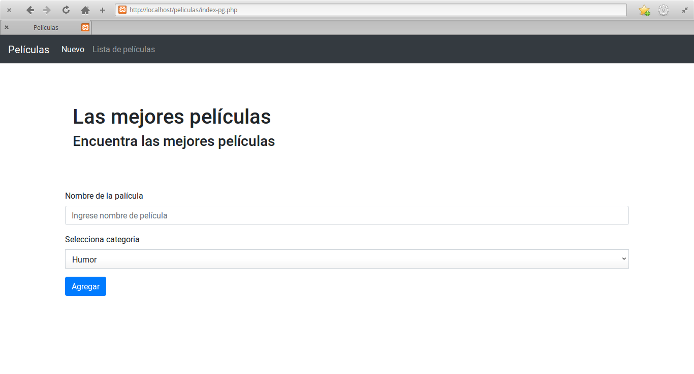

# Ejercicio de POSTGRESQL + PHP

Conexión de PHP con una base de datps en PostgreSQL de películas, donde se realiza un CRUD para manipular la información.



## Configuración y uso
En un terminal clona el repositorio
```
git clone https://github.com/calo001/pelis.git
```
Entra a la carpeta del repositorio clonado
```
cd pelis
```
Crear directorio para poder usarlo en localhost de Apache
```
sudo mkdir -p /var/www/peliculas
```
Copiamos el contenido del código fuente del proyecto a la carpeta películas
```
cp ./src/* /var/www/peliculas
```
Iniciamos sesión en postgres para crear la base de datos y el usuario
```
sudo su
su postgres
psql
```
Crear base de datos
```
CREATE DATABASE peliculas;
```
Crear usuario nuevo [Solo si no está creado]
```
CREATE USER carloslr WITH PASSWORD ‘123’;
GRANT ALL PRIVILEGES ON DATABASE peliculas TO carloslr
```
Salir de la sesión del rol postgres
```
\q
```
Iniciar sesión a la cuenta con los privilegios cedidos.
```
psql -U carloslr -h localhost -d peliculas -W
```
Creamos la tabla de pelicula
```
DROP TABLE IF EXISTS pelicula;
CREATE TABLE pelicula (
    id SERIAL,
    nombre VARCHAR (255),
    categoria VARCHAR (255)
);
```
Nos aseguramos de que exista la tabla en la base de datos
```
\dt
```
Salir de la sesión del rol carloslr
```
\q
```
Iniciamos el servidor de Apache
```
sudo /etc/init.d/apache2 start
```
Entramos a la dirección
[Localhost](http://localhost/peliculas/index-pg.php)
